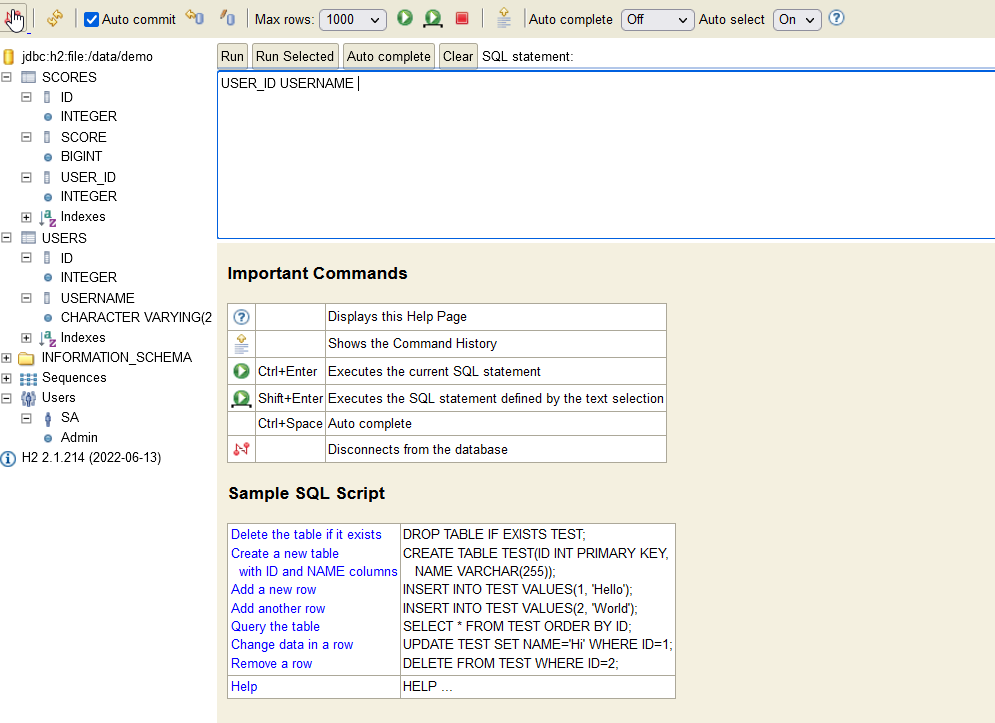
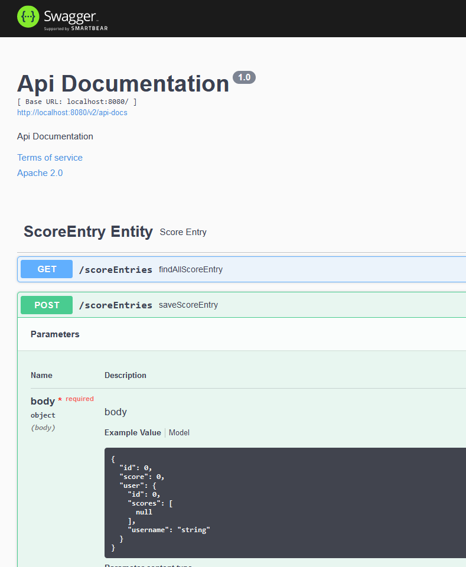

API Project
===========
This is the backend for the Unity clicker game 

How to run
------
Compile or download precompiled jar assembly, using JDK17.

Endpoints
------
/h2-console --> The database console, username is sa, password is password

/swagger-ui/#/ --> The swagger ui, to view rest api endpoints

